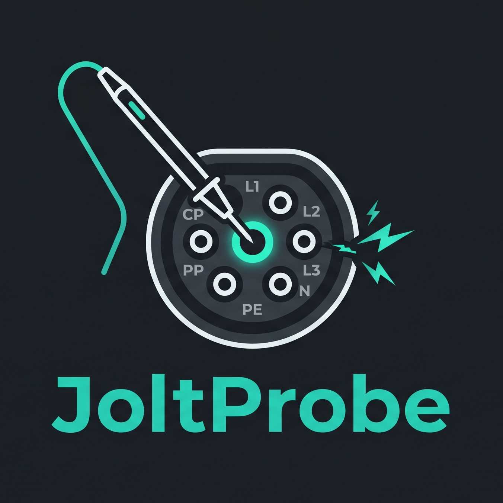

<p align="center">
  
</p>

# JoltProbe

Security assessment tool for OCPP charge point management systems (CSMS). Connects as a simulated charger and runs a suite of black-box checks across TLS, authentication, session integrity, message handling, injection, billing, and DoS categories.

Supports OCPP 1.6 and 2.0.1.

> **Only run against systems you own or have written authorisation to test.**

---

## Installation

Requires Python 3.10+.

```bash
pip install .
# or with the web UI
pip install ".[frontend]"
```

With [uv](https://github.com/astral-sh/uv):

```bash
uv pip install -e .
```

---

## Usage

### Full scan

```bash
joltprobe scan ws://csms.example.com:9000/ocpp --charger-id TEST-01
```

With auth and report output:

```bash
joltprobe scan ws://csms.example.com:9000/ocpp \
  --charger-id TEST-01 \
  --version 1.6 \
  --username admin --password secret \
  --output report.html
```

Report formats: `.json`, `.md`, `.html`.

### Run specific checks

```bash
# by category
joltprobe scan ... --checks tls,auth

# by check ID
joltprobe checks run injection.idtag --target ws://... --charger-id TEST-01
```

### DoS checks

Disabled by default — requires explicit opt-in:

```bash
joltprobe scan ... --enable-dos
```

### Web UI

```bash
joltprobe-web
# open http://localhost:8000
```

---

## Checks

| Category | What it tests |
|---|---|
| `tls` | Plaintext connections, weak TLS versions, weak ciphers, self-signed certs, missing client cert enforcement |
| `auth` | Missing Basic Auth, default credentials, arbitrary charger ID acceptance, duplicate identity, pre-boot command acceptance, idTag enumeration |
| `session` | MeterValues without a transaction, foreign transaction stop, unauthorised StartTransaction, local auth list manipulation, connector status spoofing, transaction ID enumeration, concurrent transaction handling |
| `downgrade` | Security profile downgrade on reconnect, ChangeConfiguration to lower profile, stale lower-profile credentials |
| `message` | Malformed JSON, oversized fields, wrong field types, unknown actions, missing required fields, deeply nested JSON, extreme timestamps, Unicode and null byte injection |
| `injection` | SQL, NoSQL, template, log, and CRLF injection in chargeBoxId, idTag, vendorId, messageId, StopTransaction reason, MeterValues fields, and SOAP endpoint (optional) |
| `billing` | Negative and non-monotonic meter readings |
| `websocket` | Missing or mismatched subprotocol header |
| `dos` | Connection flood, message rate limiting, large payload handling |

Run `joltprobe checks list` to see all check IDs, severities, and version support.

---

## Options reference

| Flag | Description |
|---|---|
| `--version` | OCPP version: `1.6` (default) or `2.0.1` |
| `--checks` | Comma-separated categories or check IDs to run |
| `--security-profile` | Declared security profile of the target (1–3) |
| `--timeout` | Per-check response timeout in seconds (default: 10) |
| `--output` | Save report to file (`.json`, `.md`, `.html`) |
| `--username` / `--password` | HTTP Basic Auth credentials |
| `--credential-list` | YAML file of credentials for `auth.default-credentials` |
| `--idtag-attempts` | Max idTag probe attempts for enumeration check (default: 20) |
| `--enable-dos` | Enable DoS checks |
| `--soap` | Enable SOAP/XML injection check |
